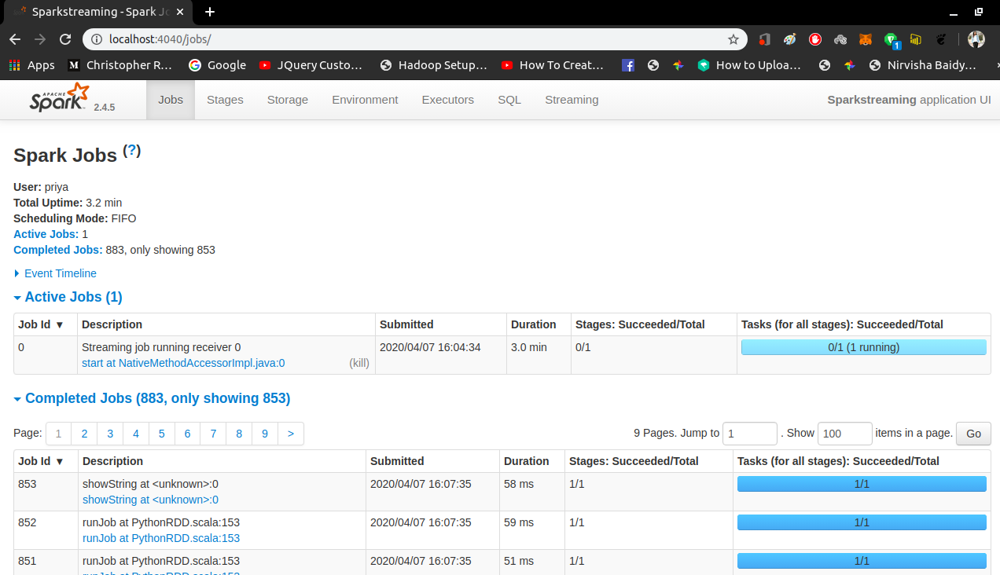
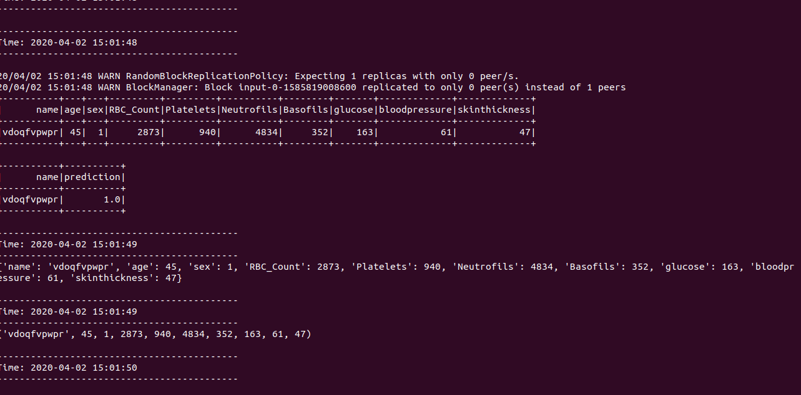
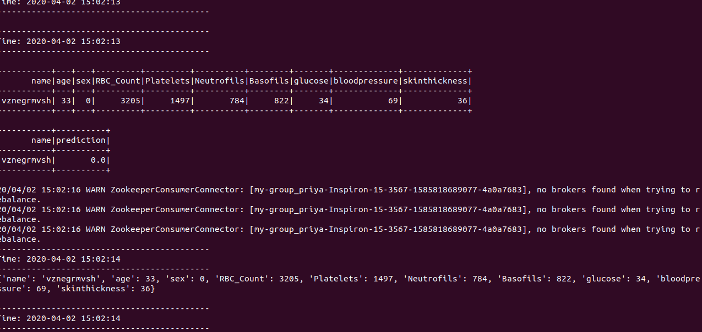
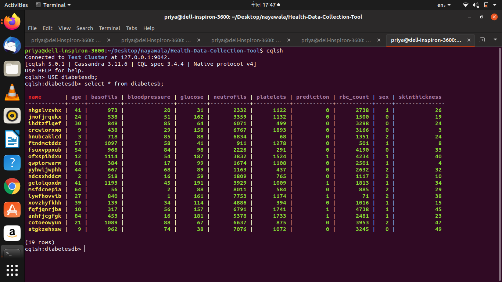
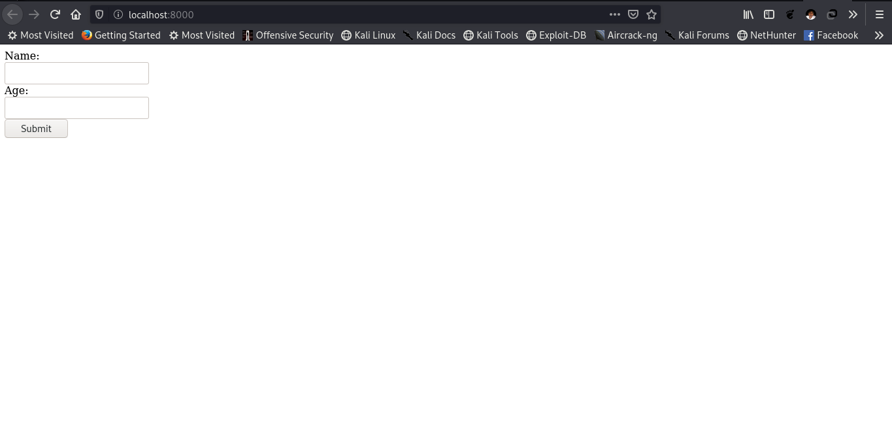
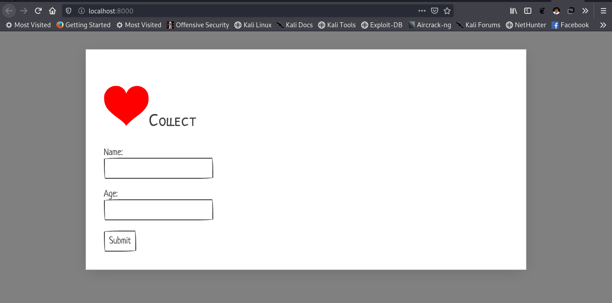

# Python Django Sqlite3

## SETUP
   - [x] Create a virtual env, for dependency issues use python 3.7.1  
   	* `$ python3 -m venv dependency_env`

   - [x] Activate virtualenv
	* `$ source dependency_env/bin/activate`

   - [x] Virtual_env package reqirements
	* `$ pip install -r requirements.txt`

### Django  
 * `$ python3 manage.py makemigrations`  
 * `$ python3 manage.py migrate`  
 * `$ python3 manage.py runserver`

### Api views
 * http://localhost:8000/api

### Data input magic
 * `$ python post_data.py`

### Updates
 * Integrated realtime data pushing code
 * Real time Api generation

#### For any migration related errors
> Delete migrations folder and db.sqlite file.Then, create new migrations folder and a \_\_init\_\_.py file inside it. Finally run django 3 commands to remove th error 😀😀.

### Create Multibrokers for Kafka (I've created 3 brokers in total with 10 partitions) 
 * To create config files for each broker:
 1. Navigate to the kafka folder
 2. Open a Terminal
 3. Execute the following copy command:

 	`$ cp config/server.properties config/server-1.properties`
 	
 	`$ cp config/server.properties config/server-2.properties`

 4. Once you copy the config files, copy paste the following content to the config files respectively.

 	For config/server1.properties:

 	`broker.id=1`

 	`listeners=PLAINTEXT://:9093`

 	`log.dir=/tmp/kafka-logs-1`

 	`zookeeper.connect=localhost:2181`

 	For config/server2.properties:

 	`broker.id=2`

 	`listeners=PLAINTEXT://:9094`

 	`log.dir=/tmp/kafka-logs-2`

 	`zookeeper.connect=localhost:2181`

 5. Setup Kafka Systemd Unit Files (This will help to manage Kafka services to start/stop using the 	systemctl command)

 	First, create systemd unit file for Zookeeper with below command:

 	`vim /etc/systemd/system/zookeeper.service`

 	Then Add below contnet:
	
	
	
	

    [Unit]  
	Description=Apache Zookeeper server  
	Documentation=http://zookeeper.apache.org  
	Requires=network.target remote-fs.target  
	After=network.target remote-fs.target  
	[Service]  
	Type=simple  
	ExecStart=/usr/local/kafka/bin/zookeeper-server-start.sh /usr/local/kafka/config/zookeeper.properties  
	ExecStop=/usr/local/kafka/bin/zookeeper-server-stop.sh  
	Restart=on-abnormal  
	[Install]  
	WantedBy=multi-user.target 
	
	
	

	Save the file and close it.

	Next, to create a Kafka systemd unit file using the following command:
	
	`vim /etc/systemd/system/kafka.service`

	Then ,add the below content.

    [Unit] 
	Description=Apache Kafka Server 
	Documentation=http://kafka.apache.org/documentation.html 
	Requires=zookeeper.service 
	[Service] 
	Type=simple 
	Environment="JAVA_HOME=/usr/lib/jvm/java-1.11.0-openjdk-amd64" 
	ExecStart=/usr/local/kafka/bin/kafka-server-start.sh /usr/local/kafka/config/server.properties 
	ExecStop=/usr/local/kafka/bin/kafka-server-stop.sh 
	[Install] 
	WantedBy=multi-user.target 

	Save file and close.
	
	Repeat for kafka1.service and kafka2.service in a similar manner as above (kafka.service)

6. `systemctl daemon-reload`

### Start Kafka Server And Zookeeper

 * `$ sudo systemctl start zookeeper`  
 * `$ sudo systemctl start kafka`  
 * `$ sudo systemctl start kafka1`
 * `$ sudo systemctl start kafka2`

 	To check whether brokers are running or not

 * `$ sudo systemctl status kafka`
 * `$ sudo systemctl status kafka1`
 * `$ sudo systemctl status kafka2`

### Create a Topic in Kafka

 * `cd /usr/local/kafka`  
 * `$ bin/kafka-topics.sh --create --zookeeper localhost:2181 --replication-factor 3 --partitions 10 	--topic hospital`  

### Kafka Consumer
 * `cd /usr/local/kafka` 
 * `bin/kafka-console-consumer.sh --bootstrap-server localhost:9092 localhost:9093 localhost:9094 --topic hospital  --from-beginning` 
 OR
 * Run python consumer.py 

### Spark Streaming and analysis
 * Make sure you have "spark-streaming-kafka-0-8-assembly_2.11-2.4.5.jar" folder on your pc (FOR OFFLINE MODE) ..If not , then  download it 
 * run python spark.py

 SPARK UI
 * http://localhost:4040

### To save on Cassandra

 * First install cassandra driver using : pip3 install cassandra-driver
 * Open your terminal and type 'cqlsh'
 * now create a keyspace(i.e. database) using:'CREATE KEYSPACE diabetesdb
WITH replication = {'class':'SimpleStrategy', 'replication_factor' : 3};'

 * Then type : 'USE diabetesdb;'
 * Then type: 'CREATE TABLE diabetesb(
   name text PRIMARY KEY,
   age int,
   sex int,
   basofils int,
   and so on (jati ota dataframe ma columns xa)
   );'

 * To check: Select * from diabetesb;

#### diabetes prediction with spark jobs

#### first version

#### second version

#### third version

